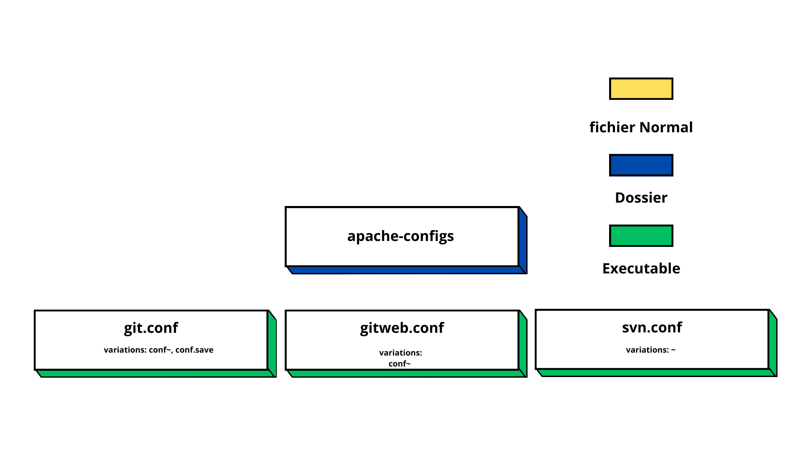
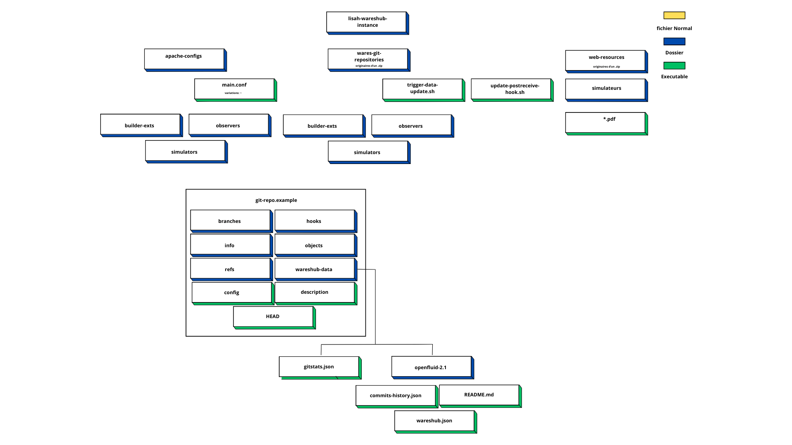
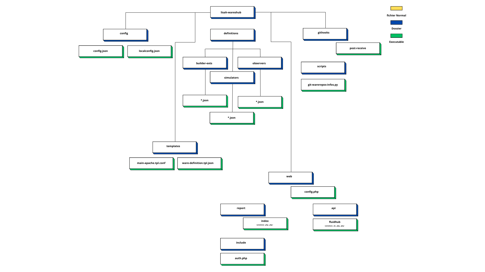
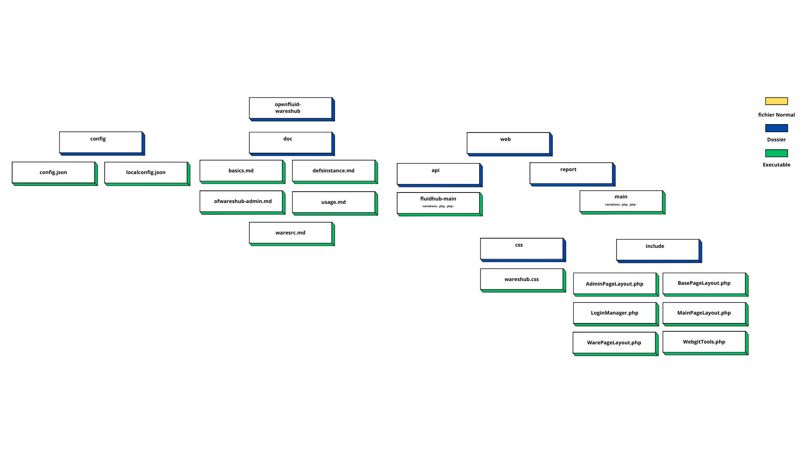
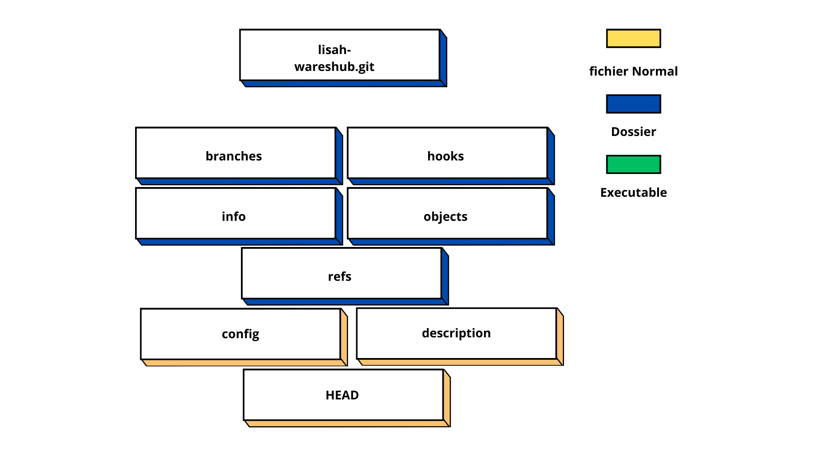
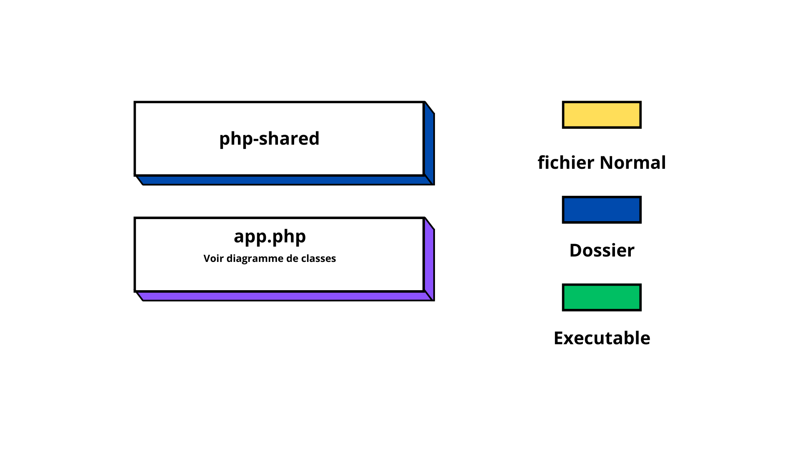

# Documentation Architecture WaresHub

There exist two files related to Wareshub in the VM  www / mtp-lisah-openfluid : 

THe file wareshub having as absolute path: `/srv/wareshub`

And the file `hub`, his absolute path being: 
`/srv/www/openfluid-project.org/hub` 

## Dossier Wareshub

Here is a simplified hierarchy of the wareshub folder:

There are 4 configuration files inside this folder, apart from other folders.

The script **lwh-batch.sh** is going to iterate a list of wareshub models defined bya variable. To then execute the command `ofwareshub-admin createware` for each object. This is going to (in theory) create one or multiple folder in `lisah-wareshub-instance/wares-git-repositories/` varying in the object type : **simulator/builderexts/observer** the absolute path will be different, the folder name will be that of the model. It's also going to change the permission access of the folder in a recursive manner. Owner and group will have read write and execute permission, other will have none [¹]. 

this script can also update the wareshub models once they are created. 

The script **lwh-batch-serial-right.sh** is a copy of the previous script. The only difference being that this script will update the wareshub models (some lines are uncommented and other ones are) instead of creating them. The model list is different from the previous script. 

**git.groups** is a user list where each user is listed inside a group

We are now going to see in detail the tree structure of wareshub:

### 
apache-configs

Inside this folder there are multiple files. But they can be bundled as three groups. We have the `git.conf` files having some variations such as `git.conf~` or `git.conf.save`. We have the `gitweb.conf` files with fluctuation like `gitweb.conf~` and finally there are the `svn.conf` files with differences like `svn.conf~`.  

The `git.conf` file will connect the server to the `/usr/lib/git-core/git-http-backend` script. Asking for an authentication using LDAP. It restrict access of certain folders to all users except a selection. This certain folders are: `lisah-wareshub`, `grudy_distrivegetaux`, `grudy_segmentationfosses`, `grudy_implementation`, `Rserveco`, `EQ_PAYSAGE` and `ANSES`.  

The `gitweb.conf` file will configure the apache connexion with the gitweb interface stored in `/usr/share/gitweb`. It's Alias is "/gitweb"

The `svn.conf` will enable and configure the svn module. It's likely that the svn configuration has multiple repository's. This is why a SVNParent is set : `SVNParentPath /data/svn`. It then enables LDAP authentication and sets an SVN Access File: `AuthzSVNAccessFile /data/dav_svn.authz`

Note: The additional files that have ~ or .save extensions added to the original are copies or previous versions of the same file. The .save extension will always be a copy of the current config file. And the ~ extension will always be a previous version of the current config file. 

### 
lisah-wareshub-instance

This folder contains all the git bare repos of our simulator/observators and builderexts. However it also stores configuration files that are directly connected to the apache2 configuration via the `openfluid-020-dev` file. The `apache-conf/main.conf`file will Include a series of configuration files too. Located inside the `apache-conf/simulators`, `apache-conf/observers` and `apache-conf/builderexts`
 folders. And creates a script alias of each wares object in the form of `lisah-wareshub/git/wares-object` to the git-http-backend script so that they are gi cloneable. 

 Additionnaly, the `main.conf` file also creates:
- The `lisah-wareshub/report` alias to the `/srv/wareshub/lisah-wareshub/web/report` folder.

- The `lisah-wareshub/api` to the `/srv/wareshub/lisah-wareshub/web/api` folder

The `lisah-wareshub/resources` alias to the `/srv/wareshub/lisah-wareshub-instance/web-resources` folder.

### 
lisah-wareshub

The lisah wareshub folder will store all the definitions of the wares objects and all the variables that are used for the Wareshub php application. Inside the `web` folder there is a `config.php` file that stores all important variables, the `index.php` file inside the `repos` folder will include all config variables and import the real application stored in the `openfluid-wareshub` folder. The repos folder will store all the frontend part of the Wareshub App

The api folder has an identical architecture to `repos`. They import `config.php` and the imports the real api php app stored inside `openfluid-wareshub`  

### 
openfluid-wareshub

The Repos PHP application is deprecated, it still works for the current Debian12 php version 8.2.18. However it was intended to work in an php 7.0 environnement. You may have to do some changes to adapt you php application to the latest php version.

The Api PHP application uses the 2.X version of the Slim php framework. The actual (17/06/2024) version of Slim works differently, meaning the Api PHP application has to change it's logic, and code and multiple parts. 

### 
lisah-wareshub.git

### 
php-shared

This folder contains the version 2.4.2 of the Slim php Framework. All of his LICENCE, README, index files have been removed, only the library containing Slim is used for the api part of Wareshub. 

### Comment la déployer 

Ce qu'on sait: 

**Configuration apache**

Il existe un fichier config apache a la racine du projet. Il me semble qu'il n'est pas relié à la configuration apache. Plusieurs dossiers apache-config à la racine du dossier wareshub et dedans `lisah-wareshub-instance`. 

**scripts de configuration**

On peut voir sur `lwh-batch.sh` une variable appellée OFWHUB_DEFSET_PATH être exporté avec la valeur `"/srv/wareshub/lisah-wareshub"` pour ensuite appeller le script `ofwareshub-admin`. On peut supposer que `ofwareshub-admin` utilise cette variable pour son execution. 

Le script `lwh-batch-serial-rights.sh` execute la commande *nano* sur `$OFWUB_DEFSET_PATH/definitions/simulators/${WID}.json`

ofwareshub-admin utilise les informations ecrites sur les fichiers json dedans `/definitions` pour créer ou mettre à jour un object wareshub.

[¹]: https://www.justegeek.fr/les-permissions-des-fichiers-sous-linux/
